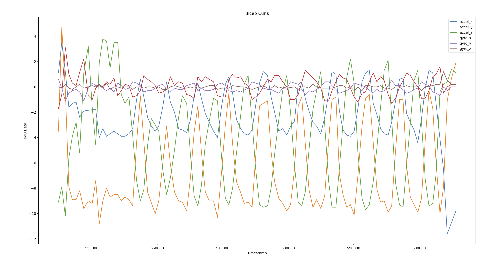
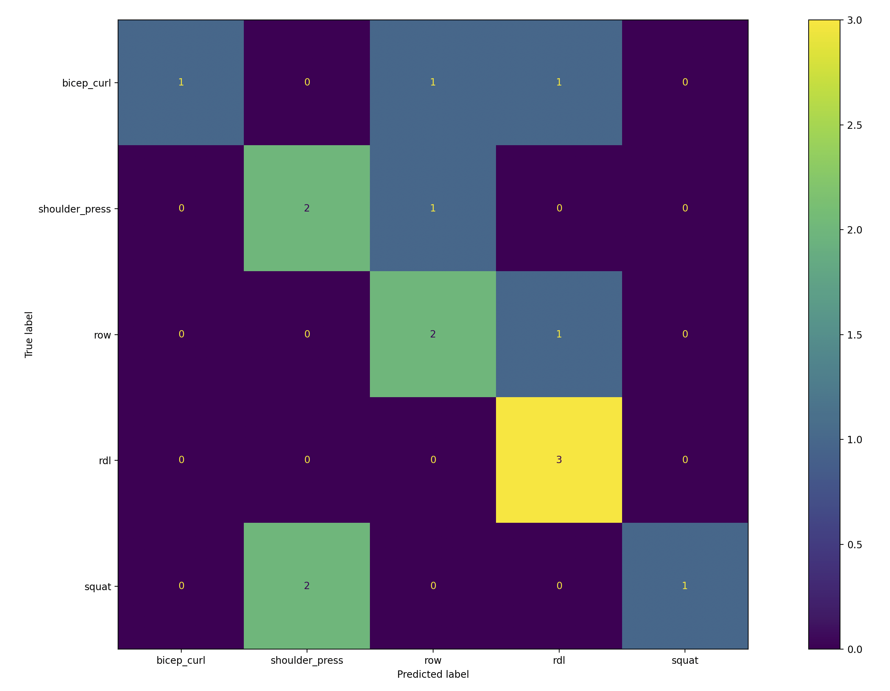

# Activity Tracking with IMU's

Our data is currently collected with the IMU attached to the center of the barbell.

### Further Ideas:
- What if we were to place the sensor on someone's wrist or ankle instead of the barbell? Could we still effectively track the activity with an ML model?
- How can we pair a watch/app with the barbell so the user's privacy is not violated?

### Questions:
- Do we need to apply a Kalman Filter on the data?
- Should we segment our data like papers?
- Should we cross-validate? If so, how many sets should people do, and how do we split across test/train/validate.

## Initial Data Analysis

### Bicep Curl

### Confusion Matrix

